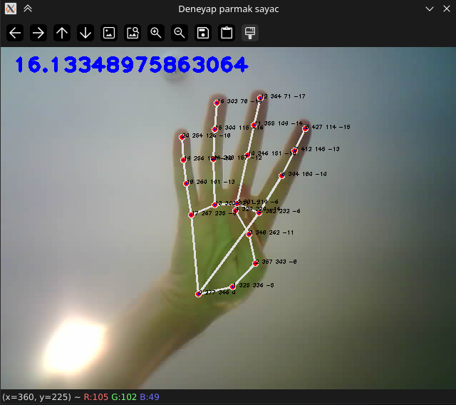
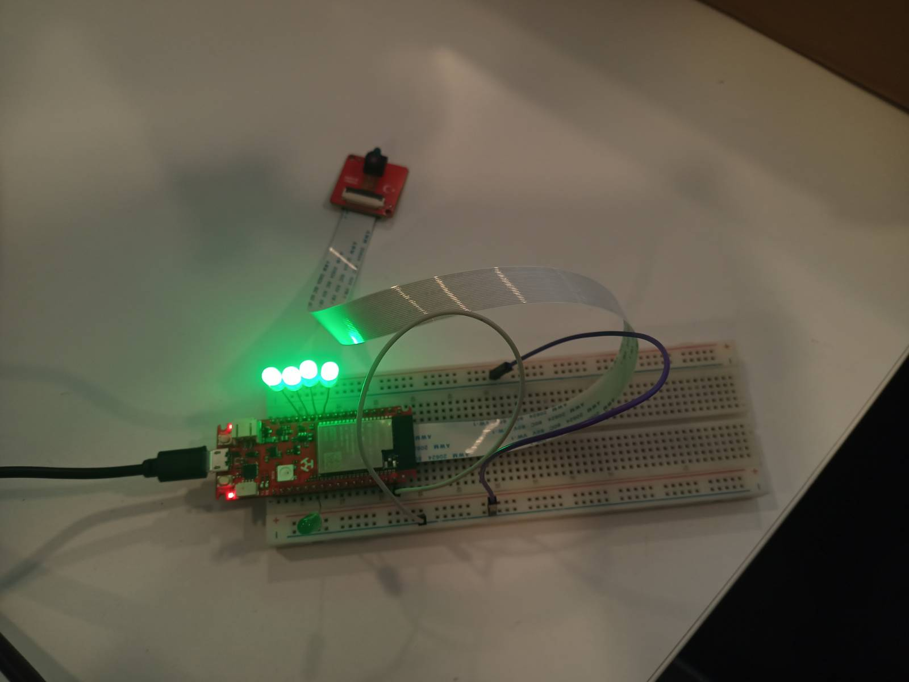
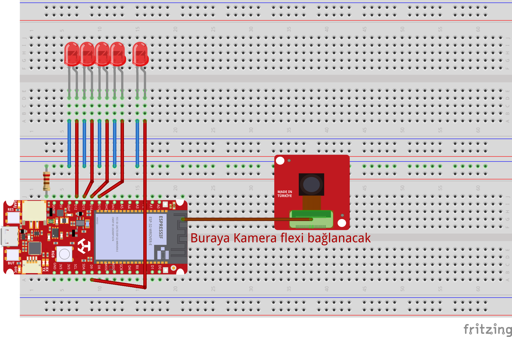
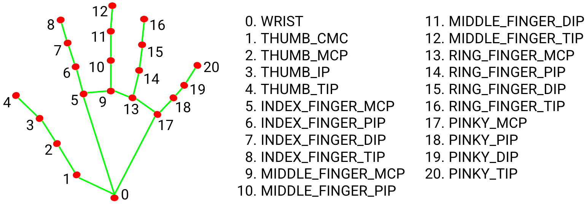
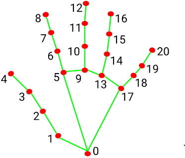
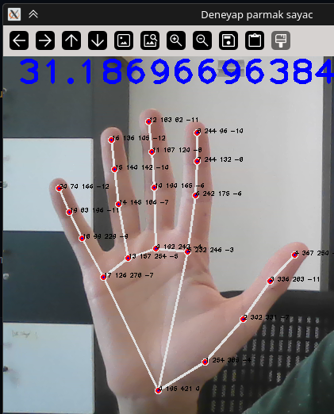
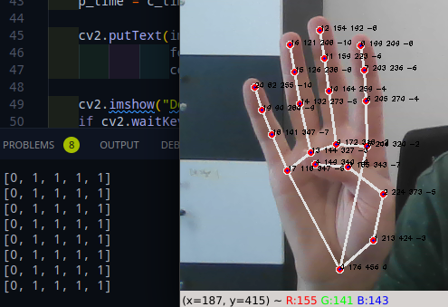

# Parmakla led yakma   
Bu prozemizde mediapipe kütüpahanesini kullanarak parmaklarımızı tanıtıp her eklemimize indis verip parmaklarımız açıp kapatmamızla Deneyap Kart ile oluşturulmuş basit bir led devresindeki ledleri kontrol etmeyi öğreneceğiz. Sonrasında asenkron tcp ile bilgisayarımızda çalıştırdığımız python koduyla işlediğimiz verileri Denyap Karta göndereceğiz.

Basit bir şekilde projeyi yapmak istesiniz Deneyap Karta github  üzerinden indirdiğiniz kodarı Araçalar(tools)-Partition Scheme->Huge APP" secilmeli

Ledleri bağladığınız pinleri karta göre gerekiyorsa düzenlenmeli. Sonrasında wifi adı ve şifrenizi gerekli kısmıları girmeniz gerekmektedir.

Kodu yükledikten sonra serial monitör üzerinden gelen  http://... ile başlayan ip adresiniz kopyalamanız gerekmektedir. İp adresiniz python kodunda dk_connection.py içinde `deneyap_ip` kısmına girmeniz gerekmektedir. istersiniz kamera ayarlarını yapmak için http://192.168.x.x ile size verilen adresi gidebilirsiniz.

Son olarak finger_count.py kodunu çalıştırdıktan sonra arktık parmaklarınızla ledlerinizi kontrol edebilirsiniz.

Küçük bir hatrılatma kod sadece sağ el için çalışmaktadır. Kendinizi geliştirmek için HandTrackingModule biraz daha geliştirip mediapipe kütüphanesinin sağaldığı özellik ile bunu yapabilirsiniz.

    
    
    
İlk olarak bu devremizde Deneyap Kart 1A versiyonunu kullanamamaktayız. Bunun haricinde kamera girişi olan diğer Deneyap Katları da kullanabilirsiniz. Bunun için sadece pinleri değiştirmeniz gerekecektir. Şu an **D12, D13, D14, D15 ve D9 **pinlerini kullanmaktayız.     
- Öncelikle Deneyap kameramızı flex kablosunu Deneyap Kart altındaki yuvaya takıyoruz.   
- Ledlerin eksi bacaklarını 220 ohm direnç bağlanacak şekilde eksi hatta direnci bağlıyoruz.   
   
Devremiz bu kadar basitti. Şimdi sırada geldi kodlamaya:   
- İlk olarak bu projemiz için Deneyap Kartın kendi kütüphanesinde olan yapay zeka yüz tanıma örneğini açıyoruz.   
- Kütüphaneler kısmından `AsyncTCP`  kütüphanesini yüklüyoruz   
- Sonrasında ledlere hızlıca ulaşabilmek için pinleri bir dizi içinde tanımlıyoruz.   
   
```
int lights[] = { D12, D13, D14, D15, D9};

```
- Sonrasında internete bağlanmak için internet adını ve şifresini giriyoruz   
   
```
const char* ssid = "AG_ADI";
const char* password = "AG_SIFRESI";
```
- Başlangıçta tanımlamalara diğer yerlerde ulaşmak için   
   
```
AsyncServer* server; //Asenkron TCP sunucusu
String dataBuffer = ""; //Verileri tamponlayacağımız bir String değişkeni

```
   
- Şimdi sıra geldi pinlerin modlarının ayarlanmasına. Önceden yukarıda liste olarak tanımladığımız pinleri `for` ile hızlı bir şeklide dönüp ayarlayabiliriz.   
   
```
  for (int i = 0; i < 5; i++) {
    pinMode(lights[i], OUTPUT);
  }

```
   
 --- 
- Şimdi sıra geldi asenkron tcp sunucusunu tanımlamaya.    
- Bunun için ilk olarak sunucumuzla hangi porttan konuşacağımızı ayarlıyoruz.   
- Sonrasında istemcinin bağlantısın yönetmek için gerekil olan fonksiyon atamasını yapıyoruz.   
- Son olarak sunucumuzu başlatıyoruz   
   
```
  server = new AsyncServer(65000);             // 65000 portu örnek bir port
  server->onClient(onClientConnect, nullptr);  // İstemci bağlantısını yönet
  server->begin();
```
- Sunucumuzu başlattığımıza göre az önce yönetmek için atadığımız fonksiyonu ayarlamaya   
- `client->onData` fonksiyonu, istemciden veri alındığında tetiklenir. Bu fonksiyon, gelen veriyi işlemek için bir lambda fonksiyonu kullanır.   
- Lambda fonksiyonu, `data` ve `len` parametrelerini alır. `data`, gelen veriyi içerirken, `len` bu verinin uzunluğunu belirtir.   
- Gelen veri, bir `String` nesnesine dönüştürülür ve `dataBuffer` adlı bir değişkene eklenir. Bu, verilerin birikmesini sağlar.   
- `dataBuffer` içinde bulunan veriler, `\n` karakterine göre ayrılır. Bu, her bir satırı işlemek için kullanılır.   
- `index` değişkeni, `dataBuffer` içinde `\n` karakterinin bulunduğu ilk konumu bulur. Eğer `\n` karakteri bulunursa, bu konumda bir döngü başlar.   
- `client->onDisconnect` fonksiyonu, istemci bağlantısı kapatıldığında tetiklenir. Bu durumda, "İstemci bağlantıyı kapattı" mesajı yazdırılır ve istemci nesnesi bellekten silinir ( `delete client;`).   
   
```
void onClientConnect(void* arg, AsyncClient* client) {
  Serial.println("Yeni bağlantı kabul edildi");

  // Gelen verileri işleyin
  client->onData([](void* arg, AsyncClient* client, void* data, size_t len) {
    String receivedData((char*)data, len);
    dataBuffer += receivedData;

    // Veriler '\n' karakterine ayrılıyor
    int index;
    while ((index = dataBuffer.indexOf('\n')) != -1) {
      String line = dataBuffer.substring(0, index);
      dataBuffer = dataBuffer.substring(index + 1);
      finger_to_light(line);
      // Gelen doğru veriyi işleyin
      Serial.println("Gelen veri: " + line);
    }

    // İstemciye yanıt gönderin
    // client->write("Veri alındı\n");
  });

  // Bağlantı kapatıldığında yapılacak işlemler
  client->onDisconnect([](void* arg, AsyncClient* client) {
    Serial.println("İstemci bağlantıyı kapattı");
    delete client;
  });
}

```
   
 --- 
- Şimdi sıra geldi istemciden gelen verileri parçalayıp, ledleri yakmaya   
- Bunun için aşağıda tanımladığımız `finger_to_light`  fonksiyonunu kullanıyoruz.   
- Temel olarak gelen gelen mesajı  (`1, 0, 1, 0, 0)`  `charAt` ile 3'er 3'er gezip değerini kontrol edip duruma göre ledi yakmasını sağlıyoruz   
   
```
void finger_to_light(String msg) {
  for (int i = 0; i < 5; i++) {
    Serial.println(msg.charAt(i * 3));
    if (msg.charAt(i * 3) == '1') {
      digitalWrite(lights[i], HIGH);
    } else {
      digitalWrite(lights[i], LOW);
    }
  }
}
```
 --- 
 --- 
## Python ile Görüntü İşleme Kısmı   
Dosya görünümü   
```
.
├── cam_connection.py
├── dk_connection.py
├── finger_count.py
├── Readme.md
├── requirements.txt
└── HandTrackingModule.py
```
Yüklenmesi gereken paketler   
```
opencv-python
mediapipe
numpy
requests
```
Yukarıdaki paketlerin yüklenmesi için sisteminizde python ve venv olması gerekiyor.   
Pardus ve Debian tabanlı sistemler için   
```
sudo apt update
sudo apt install python3 python3-venv python3-pip

```
windows için   
Pythonu resmi sitesine gidip setup dosaynı indirip kurmanız gerekmektedir. Kurulum sırasında PATH değişkenini ekle seçeniğinin seçili olduğundan emin olunuz.


- Python sanal ortamını oluşturmak için Pardus'ta uç birimi, windowsta cmd açmanız gerekecek   
- Eğer Vs code gibi bir edtör kullanıyorsanız, kullandığınız programdan termina açabilirsiniz   
- sonrasında aşağıdakı sırada ilk olarak sanal ortamı oluşturup sonrasında bun aktifleştirmesini yapıyoruz.   
   
```
python -m venv finger_count
source finger_count/bin/activate

```
- sanal ortamı aktif ettiğimize göre bağımlıkları aşağıdaki pip ile yükleyebiliriz.   
   
```
pip install -r requirements.txt

```
 --- 
Python ile kodlama kısmına geçmeden genel mantığı anlamak için yapacağımız kısımdan genel olarak bahsetmeye çalışalım.   
    
[El yer işaretleri](https://chuoling.github.io/mediapipe/images/mobile/hand_landmarks.png)   
- Kullanacağımız `mediapipe` kütüphanesi 30 bine yakın resimle eğitilip işlemci ve ekran kartı ile kullanabilmekte. İşlemci ile kullanımda herhangi bir sıkıntı çıkarmayıp gerçek zamana yakın bir performans vermektedir.   
- İşleyeceğimiz görüntüde her eklememiz belli bir adlandırmaya ve indse sahiptir. Bu sayede 3 boyutlu yerel konumunu tespit edebiliriz. Ve bize geri döndürülen listeden hızlı şekilde konumlarına erişebiliriz.   
- Kütüphanenin bize sağladığı bir kaç ek özellik de bulunmaktadır. Bunları kullanarak işleyeceğim görüntüyü daha rahat bir şekilde yönetebiliriz.   
    - [static\_image\_mode](https://chuoling.github.io/mediapipe/solutions/hands.html#static_image_mode)   
    - [max\_num\_hands](https://chuoling.github.io/mediapipe/solutions/hands.html#max_num_hands)   
    - [model\_complexity](https://chuoling.github.io/mediapipe/solutions/hands.html#model_complexity)   
    - [min\_detection\_confidence](https://chuoling.github.io/mediapipe/solutions/hands.html#min_detection_confidence)   
    - [min\_tracking\_confidence](https://chuoling.github.io/mediapipe/solutions/hands.html#min_tracking_confidence)   
- Daha detaylı bilgi için [mediapipe belgelendirmesine](https://chuoling.github.io/mediapipe/solutions/hands.html) bakabilirsiniz.   
 --- 
   
Şimdi biraz koda dalalım anlatacak çok şey var inşAllah.   
- İlk olarak gerekli kütüphanelerimizi içeri ekleyelim   
   
```
import cv2
import time
import HandTrackingModule as htm
import numpy as np

from dk_connection import get_img, get_socket, send_data
```
- Fps hesaplama için `p\_time` ilk başlangıçta tanımlayıp parmakların ucundaki indisd'leri sonradan kullanabilimek için ilk başta tanımlamasını yapıyoruz   
- Haberleşme için gerekli gerekli socketi başlattıktan sonra el tanımlama için yukarıda çağırdığım `HandTrackingModule` kütüphanesini içindeki sınıf ile obje oluşturuyoruz. Detaylı olarak bu modüle sonradan deyineceğiz   
   
```
p_time = 0
finger_top_id = [4, 8, 12, 16, 20]

start_socket()
detector = htm.handDetector(detectionCon=0.75)
```
- Sırada tüm görüntü işlemenin olduğu döngüye girelim   
- ilk olarak `get\_img()`  ile ağ üzerinden gelen görüntü ve başarı durumunu alıyoruz.   
    
   
```
success, img_resp = get_img()

```
- Sonrasında bu gelen veriyi  resim verisine dönüştürüyoruz.   
   
```
img_data = np.frombuffer(img_resp, dtype=np.uint8)
img = cv2.imdecode(img_data, cv2.IMREAD_COLOR)
```
- oluşturduğumuz görüntü verisini el verilerini tanımlamak için `detector`  ile işleyip, işlene listeyi alıyoruz   
   
```
img = detector.findHands(img=img, draw=True)
# algılanan eklemlerin konumlarını alma
lm_list = detector.findPosition(img, draw=True)
```
- Parmakların açık kapalı olduğunu anlamak için parmak uçlarındaki indisler ile bir altındaki indisleri frame(çizilen kare)'e göre y eksenindeki konumunu karşılaştırıp eğer alttaki indisin konumunda büyükse (opencv ile konumlandırma yaparken konumlama sol üstten başlayıp sağ alta doğru artmaktadır) kapalı olarak tanımlıyoruz.   
- Bu yöntem bir baş parmakta işe yaramamaktadır. Çünkü baş parmağımızı yeterince kıramadığımız için bunu yerin sağ elimizi baz alark bu sefer x eksenine göre bir karşılaştırma yaptık.   
    
- bu karşılaştırmaların sonrasında    
- Açıksa → 1   
- Kapalı ise → 0   
- Değerleri listeye eklenir.   
    
   
```
if len(lm_list) != 0:

        if lm_list[finger_top_id[0]][1] > lm_list[finger_top_id[0]-1][1]:
            fingers_open_lst.append(1)
        else:
            fingers_open_lst.append(0)
        for id in range(1, 5):
            if lm_list[finger_top_id[id]][2] < lm_list[finger_top_id[id]-2][2]:
                fingers_open_lst.append(1)
            else:
                fingers_open_lst.append(0)
```
- Parmakları algıladığımıza göre artık gönderebiliriz. Bu verileri Deneyap Karta gönderebiliriz. Bunu için yukarıda tanımladığım `send_data()` ile verileri filtreleyip gönderiyoruz.    
   
```
if len(fingers_open_lst) > 0:
    send_data(str(fingers_open_lst)[1:-1])
```
- Son olarak performansı görmek için fps hesplaması yapıp resme yazdırıyoruz.   
   
```
    c_time = time.time()
    fps = 1/(c_time-p_time)
    p_time = c_time

    cv2.putText(img=img, text=str(fps), org=(17, 35),
                fontFace=cv2.FONT_HERSHEY_PLAIN, fontScale=2,
                color=(255, 0, 0), thickness=3)
```
 --- 
Kod, el izleme işlemleri için bir sınıf ( `handDetector`) tanımlar ve bu sınıfı kullanarak bir video akışında elleri tespit eder. `mediapipe` kütüphanesi, el tespiti ve izleme işlemleri için kullanılır. Kod, bir video kaynağından (örneğin, bir webcam) görüntü alır ve bu görüntü üzerinde el tespiti yapar.   
### Kütüphanelerin İçe Aktarılması   
```
import cv2
import mediapipe as mp
import time

```
### handDetector Sınıfı   
```
class handDetector():
    def __init__(self, mode=False, maxHands=2, detectionCon=0.5, trackCon=0.5):


```
- `__init__`: Sınıfın yapıcı metodu. El tespiti için gerekli parametreleri alır.   
    - `mode`: Statik görüntü modunu belirler (varsayılan `False`).   
    - `maxHands`: Maksimum tespit edilecek el sayısı (varsayılan `2`).   
    - `detectionCon`: Tespit için minimum güvenilirlik eşiği (varsayılan `0.5`).   
    - `trackCon`: İzleme için minimum güvenilirlik eşiği (varsayılan `0.5`).   
   
```
        self.mpHands = mp.solutions.hands
        self.hands = self.mpHands.Hands(
            static_image_mode=False,
            max_num_hands=2,
            model_complexity=0,
            min_detection_confidence=0.5,
            min_tracking_confidence=0.5)

```
- `mpHands`: Mediapipe el tespiti modülünü tanımlar.   
- `self.hands`: El tespiti için bir `Hands` nesnesi oluşturur. Bu nesne, görüntüdeki elleri tespit etmek için kullanılır.   
   
```
self.mpDraw = mp.solutions.drawing_utils

```
- `mpDraw`: Tespit edilen el eklemlerini çizmek için kullanılan yardımcı fonksiyonları içerir.   
   
### findHands Metodu   
```
def findHands(self, img, draw=True):

```
- `findHands`: Verilen bir görüntüde elleri tespit eder ve istenirse eklemleri çizer.   
   
```
imgRGB = cv2.cvtColor(img, cv2.COLOR_BGR2RGB)

```
- Gelen görüntüyü BGR renk alanından RGB renk alanına dönüştürür. Mediapipe, RGB formatında çalışır.   
   
```
self.results = self.hands.process(imgRGB)

```
- `process`: RGB görüntüsünü işleyerek elde edilen sonuçları `self.results` değişkenine atar.   
   
```
        if self.results.multi_hand_landmarks:
            for handLms in self.results.multi_hand_landmarks:
                if draw:
                    self.mpDraw.draw_landmarks(img, handLms, self.mpHands.HAND_CONNECTIONS)

```
- Eğer birden fazla el tespit edilirse, her bir elin eklemleri üzerinde döngü başlatılır. `draw_landmarks` fonksiyonu, eklemler arasındaki bağlantıları çizer.   
   
```

return img

```
- İşlenmiş görüntüyü döndürür.   
   
### findPosition Metodu   
```
def findPosition(self, img, handNo=0, draw=True):

```
- `findPosition`: Belirtilen elin eklem pozisyonlarını bulur ve döndürür.   
   
```
        lmList = []
        if self.results.multi_hand_landmarks:
            myHand = self.results.multi_hand_landmarks[handNo]

```
- `lmList`: Eklemlerin konumlarını saklamak için bir liste oluşturur. Eğer tespit edilen eller varsa, belirtilen elin eklemleri alınır.   
   
```
            for id, lm in enumerate(myHand.landmark):
                h, w, c = img.shape
                cx, cy = int(lm.x * w), int(lm.y * h)
                lmList.append([id, cx, cy])

```
- Her bir eklem için döngü başlatılır. Eklemlerin `x` ve `y` koordinatları, görüntünün boyutları ile çarpılarak piksel cinsine dönüştürülür ve `lmList` listesine eklenir.   
   
```
                if draw:
                    cv2.circle(img, (cx, cy), 1, (255, 0, 0), cv2.FILLED)
                    cv2.putText(img, str(id) + " " + str(cx) + " " + str(cy) + " " +  str(int(lm.z*100)),
                                (cx, cy), cv2.FONT_HERSHEY_PLAIN, 0.5, (0, 0, 0), 1)

```
- Eğer `draw` parametresi `True` ise, her bir eklemin konumunu gösteren bir daire çizer ve eklemin ID'si ile konumunu görüntüye yazar.   
   
```
        return lmList

```
- Eklemlerin konumlarını içeren listeyi döndürür.   
   
### main Fonksiyonu   
```
def main():
    pTime = 0
    cTime = 0
    cap = cv2.VideoCapture(1)
    detector = handDetector()

```
- `main`: Programın ana fonksiyonu. Zaman değişkenleri ve video kaynağı oluşturulur. `handDetector` sınıfından bir nesne oluşturulur.   
   
```
    while True:
        success, img = cap.read()
        img = detector.findHands(img)
        lmList = detector.findPosition(img)

```
- Sonsuz bir döngü başlatılır. Her döngüde video kaynağından bir görüntü alınır, bu görüntüde eller tespit edilir ve eklem pozisyonları bulunur.   
   
```
        if len(lmList) != 0:
            print(lmList[4])

```
- Eğer eklem listesi boş değilse, 4. eklemin (başparmak ucu) konumu yazdırılır.   
   
```
        cTime = time.time()
        fps = 1 / (cTime - pTime)
        pTime = cTime

```
- FPS hesaplaması yapılır. `cTime` ile `pTime` arasındaki fark kullanılarak FPS değeri hesaplanır.   
   
```
        cv2.putText(img, str(int(fps)), (10, 70), cv2.FONT_HERSHEY_PLAIN, 3,
                    (255, 0, 255), 3)

```
- Hesaplanan FPS değeri görüntüye yazdırılır.   
   
```
        cv2.imshow("Image", img)
        cv2.waitKey(1)

```
- İşlenmiş görüntü ekranda gösterilir. `waitKey(1)` ile bir tuşa basılmasını bekler.   
   
```
if __name__ == "__main__":
    main()

```
- Eğer bu dosya doğrudan çalıştırılırsa, `main` fonksiyonu çağrılır.   
   
   
 --- 
- Şimdi sıra geldi aradaki haberleşme işlemlerinin sağlandığı `dk_connection`  kodlarına   
- Burada ilk olarak deneyap kart için atanan ip  ve port'un yazılması gerekiyor. Karta kod yüklediğiniz zaman veya yeniden başlattığınız zaman serial monitörden ip adresi paylaşılıyor. Onun buraya yapıştırmanız gerekmektedir.    
   
```
deneyap_ip = '192.168.2.34'
kamera_port = 80
```
- Sonrasında Deneyap Kart üzeniden web sunucu üzerinden yayınlanan kamera verisini alıp `get_image()`  fonksiyonu ile gelen veri alınıyor.   
   
```
def get_img():
    resp = requests.get(url)
    if resp.status_code == 200:
        return True, resp.content
```
- Veri Gönderme bölümünde ise tcp ile veri göndermek için ilk öncelikle alıcı(client) soketimizi oluşturuyoruz.   
- Sonrasında soketi başka bir yerde başlatabilmek için `start_socket()` fonksiyonunu tanımlıyoruz.   
- Burada global olarak `client_socket` alıp while ile en fazla 10 kere denenebilecek.   
   
```
client_socket: socket

def start_socket():
    c = 0
    global client_socket
    while (c < 10):
        client_socket = socket.socket(socket.AF_INET, socket.SOCK_STREAM)
        server_address = (deneyap_ip, 65000)
        try:
            client_socket.connect(server_address)
            return
        except Exception as e:
            c += 1
            print(e)
```
- Son olarak verilerimizi göndermek için oluşturduğumuz soket ile `sendall` ile gönderip mesajımızı encode ediyoruz yani mesajı byte formatına dönüşütürp gönderiyoruz.   


Yararlandığım kaynaklar:
- https://github.com/murtazahassan
- https://chuoling.github.io/mediapipe/solutions/hands.html